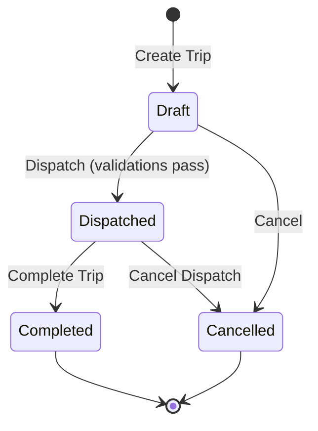
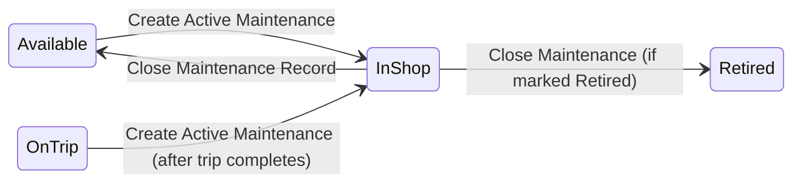
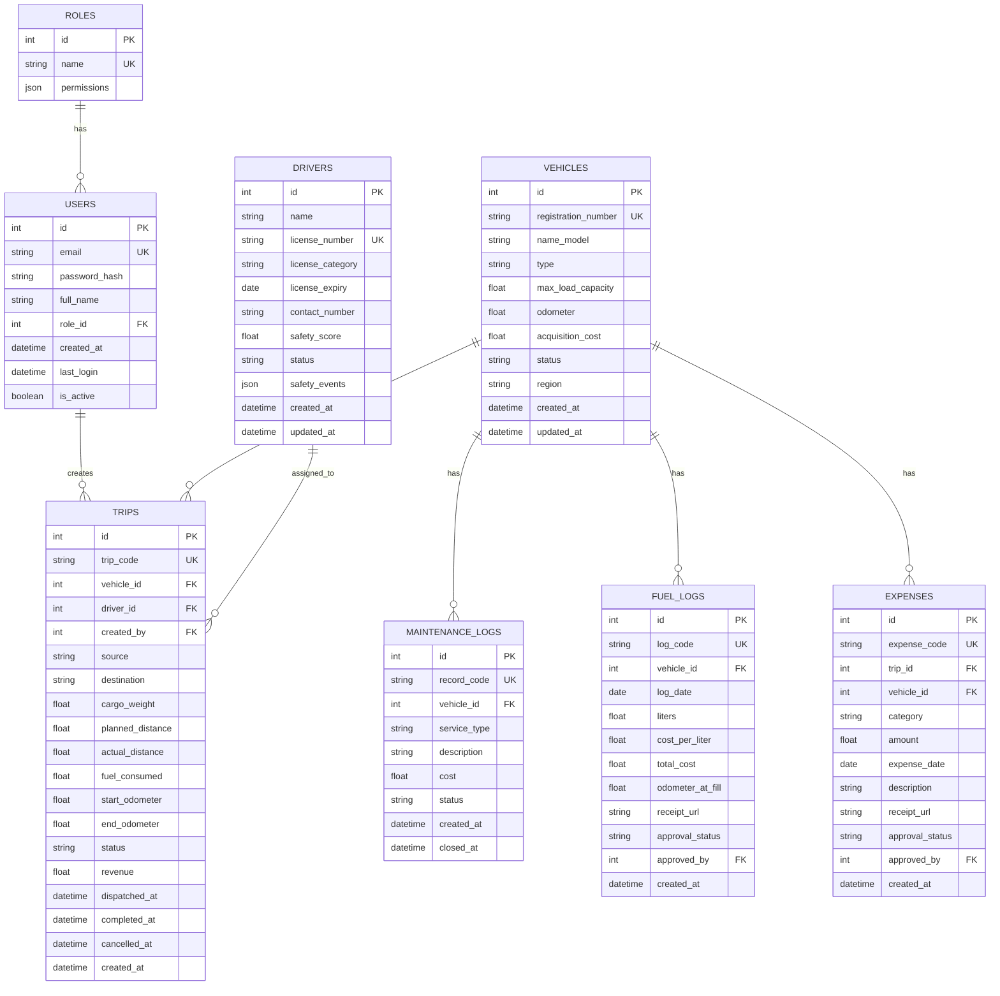
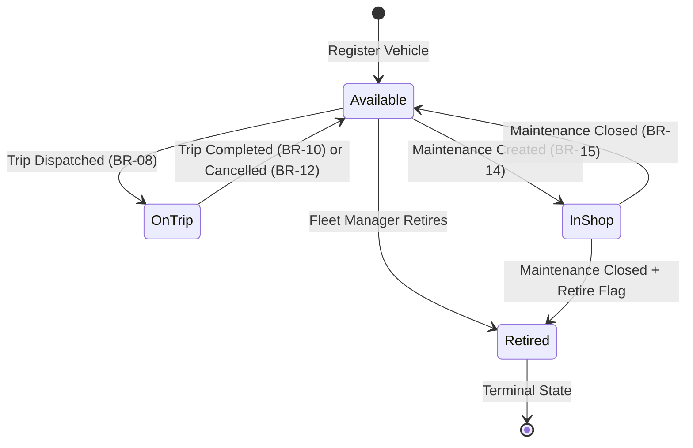
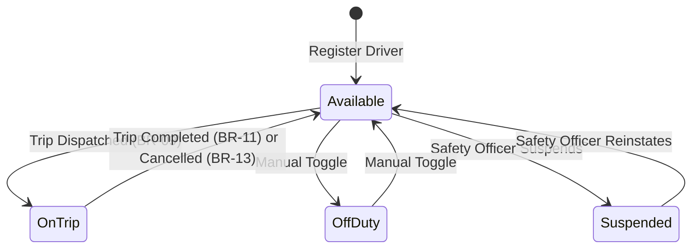
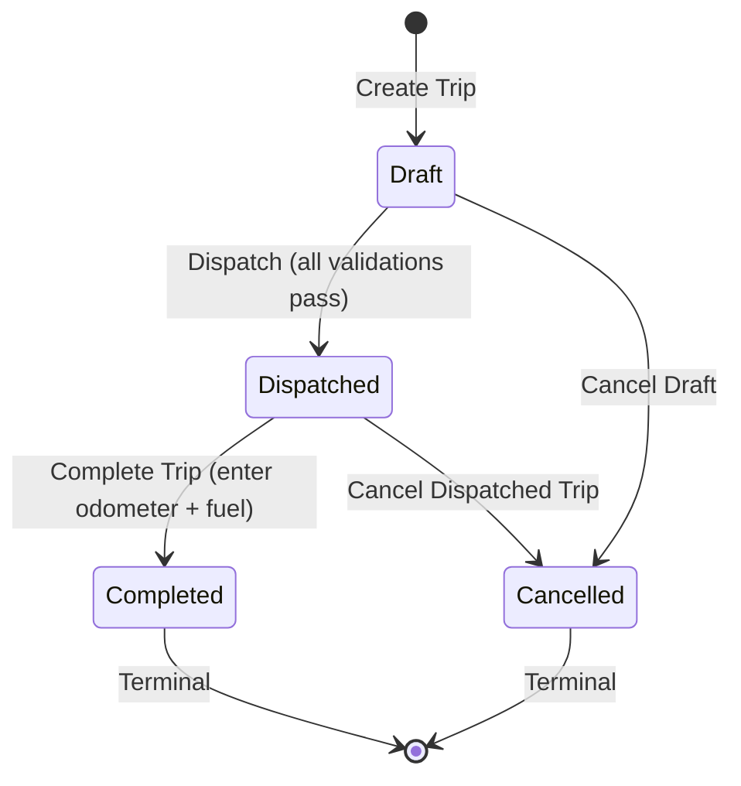

# TransitOps — Product Requirements Document (PRD)

**Version**: 1.0  
**Date**: July 12, 2026  
**Event**: Odoo Hackathon — Virtual Round (8-Hour Sprint)  
**Author**: Team TransitOps

---

## Table of Contents

1. [Executive Summary](#1-executive-summary)
2. [Problem Statement](#2-problem-statement)
3. [Target Users & Personas](#3-target-users--personas)
4. [Information Architecture & Navigation](#4-information-architecture--navigation)
5. [Module Specifications](#5-module-specifications)
   - 5.1 [Authentication & RBAC](#51-authentication--rbac)
   - 5.2 [Dashboard](#52-dashboard)
   - 5.3 [Vehicle Registry](#53-vehicle-registry)
   - 5.4 [Driver Management & Safety](#54-driver-management--safety)
   - 5.5 [Trip Dispatcher](#55-trip-dispatcher)
   - 5.6 [Maintenance](#56-maintenance)
   - 5.7 [Fuel & Expense Management](#57-fuel--expense-management)
   - 5.8 [Reports & Analytics](#58-reports--analytics)
   - 5.9 [Settings & RBAC Configuration](#59-settings--rbac-configuration)
6. [Database Schema](#6-database-schema)
7. [Business Rules Engine](#7-business-rules-engine)
8. [State Machines](#8-state-machines)
9. [API Contracts](#9-api-contracts)
10. [Tech Stack](#10-tech-stack)
11. [Non-Functional Requirements](#11-non-functional-requirements)
12. [8-Hour Sprint Plan](#12-8-hour-sprint-plan)
13. [Bonus Features Strategy](#13-bonus-features-strategy)
14. [Acceptance Criteria](#14-acceptance-criteria)

---

## 1. Executive Summary

**TransitOps** is a centralized, real-time transport operations platform that digitizes the full lifecycle of fleet management — from vehicle registration and driver onboarding to dispatching, maintenance scheduling, fuel logging, and operational analytics. It replaces spreadsheets and manual logbooks with an intelligent, rule-enforced system that prevents scheduling conflicts, blocks overloaded or non-compliant dispatches, auto-manages status transitions, and delivers actionable KPIs.

### Core Value Propositions

| Pillar | Value |
|---|---|
| **Operational Safety** | Blocks expired-license drivers, suspended personnel, and overweight cargo from dispatch |
| **Asset Optimization** | Real-time fleet utilization tracking, automatic maintenance state management |
| **Financial Transparency** | Per-vehicle operational cost rollup (fuel + maintenance + tolls), ROI computation |
| **Compliance Enforcement** | RBAC with granular module permissions, audit trails, license expiry monitoring |

---

## 2. Problem Statement

Logistics companies relying on spreadsheets and manual logbooks face:

- **Scheduling conflicts**: Double-booking vehicles/drivers on simultaneous trips
- **Underutilized assets**: No visibility into which vehicles are idle, in-shop, or retired
- **Missed maintenance**: No automated triggers when vehicles enter/exit maintenance
- **Expired compliance**: Drivers with lapsed licenses dispatched unknowingly
- **Inaccurate costs**: Fuel, tolls, and maintenance expenses tracked ad-hoc with no vehicle-level rollup
- **Poor visibility**: No dashboard KPIs or analytics for management decisions

TransitOps solves ALL of these with enforced business rules, automatic state transitions, and real-time dashboards.

---

## 3. Target Users & Personas

### 3.1 Fleet Manager — "Priya"
| Attribute | Detail |
|---|---|
| **Goal** | Oversee fleet health, vehicle lifecycle, and maintenance scheduling |
| **Primary Modules** | Vehicle Registry, Maintenance, Dashboard |
| **Key Frustration** | Vehicles sit in maintenance for weeks without visibility |
| **RBAC Access** | Full access: Fleet, Maintenance. View-only: Trips, Reports |

### 3.2 Dispatcher — "Raven"
| Attribute | Detail |
|---|---|
| **Goal** | Create and dispatch trips efficiently while respecting business rules |
| **Primary Modules** | Trip Dispatcher, Dashboard |
| **Key Frustration** | Accidentally assigning an in-use vehicle or suspended driver |
| **RBAC Access** | Full access: Dashboard, Trips. View-only: Fleet, Drivers |

### 3.3 Safety Officer — "Carlos"
| Attribute | Detail |
|---|---|
| **Goal** | Monitor driver compliance, license validity, safety scores |
| **Primary Modules** | Driver Management, Fuel Logs |
| **Key Frustration** | No automated alerts for expiring licenses |
| **RBAC Access** | Full access: Drivers, Fuel. View-only: Fleet, Trips |

### 3.4 Financial Analyst — "Maya"
| Attribute | Detail |
|---|---|
| **Goal** | Analyze operational costs, fuel efficiency, and vehicle ROI |
| **Primary Modules** | Reports & Analytics, Fuel & Expenses |
| **Key Frustration** | Manually computing per-vehicle profitability from scattered data |
| **RBAC Access** | Full access: Expenses, Reports. View-only: Fleet, Trips |

---

## 4. Information Architecture & Navigation

### 4.1 Sidebar Navigation Structure

```
┌─────────────────────────────────┐
│  🚛 TransitOps                  │
│  ─────────────────────────────  │
│  📊  Dashboard                  │
│  🚗  Vehicle Registry           │
│  👤  Drivers & Safety           │
│  🗺️   Trip Dispatcher           │
│  🔧  Maintenance                │
│  ⛽  Fuel & Expenses            │
│  📈  Reports & Analytics        │
│  ⚙️   Settings                  │
│  ─────────────────────────────  │
│  🔓  Logout                     │
└─────────────────────────────────┘
```

### 4.2 Layout Structure (All Module Pages)

Every authenticated page follows a consistent layout:

```
┌──────────┬──────────────────────────────────────────┐
│          │  Header: Breadcrumb / Module Title        │
│  Side    │  ────────────────────────────────────────  │
│  Nav     │                                            │
│  (Fixed) │  Filters / Search Bar / Action Buttons     │
│          │                                            │
│          │  Main Content Area                         │
│          │  (Tables, Forms, Charts, Cards)            │
│          │                                            │
└──────────┴──────────────────────────────────────────┘
```

### 4.3 Responsive Breakpoints

| Breakpoint | Width | Sidebar Behavior |
|---|---|---|
| Desktop | ≥ 1024px | Fixed, always visible |
| Tablet | 768px – 1023px | Collapsible (icon-only) |
| Mobile | < 768px | Hidden, hamburger toggle |

---

## 5. Module Specifications

---

### 5.1 Authentication & RBAC

#### 5.1.1 Login Page

**UI Components:**

| Element | Type | Specification |
|---|---|---|
| Logo | Image | TransitOps brand logo, centered top |
| Email Field | Input (email) | Placeholder: `name@transitops.in` |
| Password Field | Input (password) | Toggle visibility icon (eye) |
| Role Selector | Dropdown | Options: Fleet Manager, Dispatcher, Safety Officer, Financial Analyst |
| Remember Me | Checkbox | Persists session for 7 days |
| Forgot Password | Link | Navigates to password reset flow |
| Sign In Button | Primary Button | Submits credentials |

**Validation Rules:**
- Email: RFC 5322 compliant, required
- Password: Min 8 chars, 1 uppercase, 1 number, 1 special char
- Role: Required selection

**Error States:**
- Invalid credentials: Red banner → _"Invalid email or password. Please try again."_
- Account lockout after 5 failed attempts: → _"Account locked. Contact your administrator."_
- Empty field: Inline red error under each field

**Session Management:**
- JWT-based authentication
- Access token TTL: 1 hour
- Refresh token TTL: 7 days (with "Remember Me")
- Token stored in `httpOnly` cookies

#### 5.1.2 RBAC Permission Matrix

| Module | Fleet Manager | Dispatcher | Safety Officer | Financial Analyst |
|---|---|---|---|---|
| Dashboard | ✅ Full | ✅ Full | 👁️ View | 👁️ View |
| Fleet (Vehicles) | ✅ Full | 👁️ View | ❌ None | 👁️ View |
| Drivers | 👁️ View | 👁️ View | ✅ Full | ❌ None |
| Trips | 👁️ View | ✅ Full | 👁️ View | 👁️ View |
| Maintenance | ✅ Full | ❌ None | ❌ None | 👁️ View |
| Fuel & Expenses | 👁️ View | ❌ None | ✅ Full | ✅ Full |
| Reports | ✅ Full | 👁️ View | 👁️ View | ✅ Full |
| Settings | ✅ Full | ❌ None | ❌ None | ❌ None |

**Access Enforcement:**
- Sidebar items: Greyed out or hidden for unauthorized modules
- API endpoints: Return `403 Forbidden` for unauthorized roles
- UI actions (Create/Edit/Delete): Buttons hidden or disabled per role

---

### 5.2 Dashboard

#### 5.2.1 KPI Cards (Top Row)

Seven metric cards displayed in a responsive grid:

| KPI | Icon | Value Type | Color Theme | Source |
|---|---|---|---|---|
| Active Vehicles | 🚗 | Integer | Blue | `vehicles WHERE status = 'On Trip'` |
| Available Vehicles | ✅ | Integer | Green | `vehicles WHERE status = 'Available'` |
| Vehicles in Maintenance | 🔧 | Integer | Orange | `vehicles WHERE status = 'In Shop'` |
| Active Trips | 🗺️ | Integer | Purple | `trips WHERE status = 'Dispatched'` |
| Pending Trips | ⏳ | Integer | Yellow | `trips WHERE status = 'Draft'` |
| Drivers on Duty | 👤 | Integer | Teal | `drivers WHERE status = 'On Trip'` |
| Fleet Utilization | 📊 | Percentage | Gradient | `(Active + On Trip) / Total × 100` |

**Card Design:**
- Subtle glassmorphism background
- Large numeric value (28px bold)
- Label below (14px medium)
- Animated count-up on page load
- Subtle hover lift effect

#### 5.2.2 Recent Trips Table

| Column | Type | Sort | Filter |
|---|---|---|---|
| Trip ID | Auto-generated string (e.g., `TRP-00142`) | ✅ | ❌ |
| Vehicle | Model name + Reg number | ✅ | ✅ |
| Driver | Full name | ✅ | ✅ |
| Source → Destination | Text | ❌ | ✅ |
| Status | Badge (color-coded) | ✅ | ✅ |
| ETA | Date/Time | ✅ | ❌ |

**Status Badge Colors:**
- `Draft` → Grey
- `Dispatched` → Blue
- `On Trip` → Orange/Amber (animated pulse)
- `Completed` → Green
- `Cancelled` → Red

#### 5.2.3 Vehicle Status Chart

- **Type**: Stacked horizontal bar chart OR donut chart
- **Segments**: Available (green), On Trip (blue), In Shop (orange), Retired (grey)
- **Interaction**: Hover tooltips with exact counts and percentages
- **Library**: Chart.js or Recharts

#### 5.2.4 Filters

| Filter | Type | Options |
|---|---|---|
| Vehicle Type | Multi-select dropdown | Van, Truck, Mini, Bus, Sedan |
| Status | Multi-select dropdown | Available, On Trip, In Shop, Retired |
| Region | Dropdown | North, South, East, West, All |
| Date Range | Date picker | Last 7/30/90 days, Custom |

---

### 5.3 Vehicle Registry

#### 5.3.1 Vehicle List View

**Action Bar:**
- `+ Add Vehicle` button (primary, top right) — only for Fleet Manager
- Search input: Searches across Registration Number, Name/Model
- Filter dropdowns: Type, Status

**Table Columns:**

| Column | Type | Editable | Validation |
|---|---|---|---|
| Registration Number | String (unique) | Create-only | Alphanumeric, max 15 chars, unique |
| Name / Model | String | ✅ | Required, max 50 chars |
| Type | Enum | ✅ | Van, Truck, Mini, Bus, Sedan |
| Max Load Capacity | Number (kg) | ✅ | > 0, max 50000 |
| Odometer (km) | Number | ✅ | ≥ 0 |
| Acquisition Cost (₹) | Currency | ✅ | ≥ 0 |
| Status | Enum/Badge | System-managed | Available, On Trip, In Shop, Retired |

**Row Actions (visible per role):**
- 👁️ View Details
- ✏️ Edit (Fleet Manager only)
- 🗑️ Retire (Fleet Manager only — soft delete, sets status to Retired)

#### 5.3.2 Add/Edit Vehicle Modal

```
┌──────────────────────────────────────┐
│  🚗 Add New Vehicle                  │
│  ──────────────────────────────────  │
│                                       │
│  Registration Number*  [________]    │
│  Vehicle Name/Model*   [________]    │
│  Type*         [Dropdown ▾]          │
│  Max Capacity (kg)*    [________]    │
│  Odometer (km)         [________]    │
│  Acquisition Cost (₹)  [________]    │
│                                       │
│  [Cancel]          [Save Vehicle]    │
└──────────────────────────────────────┘
```

**Validation on Submit:**
- Registration Number: Check uniqueness via API before submit
- All `*` fields required
- Max Capacity > 0
- Inline error messages below each field

#### 5.3.3 Business Rules

| Rule | Enforcement |
|---|---|
| Registration number must be unique | DB unique constraint + frontend pre-check |
| Retired vehicles cannot be un-retired | UI hides the option; API rejects |
| Status is system-managed | Status field is read-only in forms |
| New vehicles default to `Available` | Set by backend on creation |

---

### 5.4 Driver Management & Safety

#### 5.4.1 Driver List View

**Action Bar:**
- `+ Add Driver` button (primary) — Safety Officer only
- Search: By name, license number
- Filter: By status (Available, On Trip, Off Duty, Suspended)

**Table Columns:**

| Column | Type | Description |
|---|---|---|
| Driver Name | String | Full name |
| License No. | String (unique) | Driving license number |
| License Category | Enum | LMV, HMV, HGV, etc. |
| License Expiry | Date | Highlighted red if ≤ 30 days or expired |
| Assigned Vehicle | FK → Vehicle | Current assignment (if On Trip) |
| Safety Events | Tags/Badges | e.g., "Speeding", "Hard Brake" |
| Compliance Status | Badge | `Valid DL` (green), `Expiring` (yellow), `Expired DL` (red) |
| Safety Score | Percentage (0-100) | Color-coded: ≥80 green, 50-79 yellow, <50 red |
| Status | Badge | Available (green), On Trip (blue), Off Duty (grey), Suspended (red) |

**Row Actions:**
- 👁️ View Profile
- ✏️ Edit (Safety Officer only)
- ⚠️ Suspend / Reinstate (Safety Officer only)

#### 5.4.2 Add/Edit Driver Modal

```
┌──────────────────────────────────────┐
│  👤 Add New Driver                   │
│  ──────────────────────────────────  │
│                                       │
│  Full Name*            [________]    │
│  License Number*       [________]    │
│  License Category*     [Dropdown ▾]  │
│  License Expiry Date*  [📅 Picker]   │
│  Contact Number*       [________]    │
│  Initial Safety Score  [____100___]  │
│                                       │
│  [Cancel]            [Save Driver]   │
└──────────────────────────────────────┘
```

#### 5.4.3 Compliance Logic

| Condition | Compliance Badge | Dispatch Eligible? |
|---|---|---|
| Expiry > 30 days away | `Valid DL` (green) | ✅ Yes |
| Expiry ≤ 30 days away | `Expiring Soon` (yellow) | ✅ Yes (with warning) |
| Expiry date passed | `Expired DL` (red) | ❌ Blocked |
| Status = Suspended | `Suspended` (red) | ❌ Blocked |

---

### 5.5 Trip Dispatcher

#### 5.5.1 Trip List / Map View

The dispatcher screen features a **split layout**:

```
┌──────────────────────┬─────────────────────┐
│                      │                     │
│   Map View           │  Trip Planner       │
│   (Interactive)      │  Form / Details     │
│                      │                     │
│   • Active routes    │  Source: [______]   │
│   • Vehicle markers  │  Dest:  [______]   │
│   • Color-coded      │  Vehicle: [▾]      │
│     by status        │  Driver:  [▾]      │
│                      │  Cargo:  [___] kg  │
│                      │  Distance: [___]   │
│                      │                     │
│                      │  [Dispatch Trip]    │
└──────────────────────┴─────────────────────┘
```

#### 5.5.2 Trip Creation Form

| Field | Type | Validation | Source |
|---|---|---|---|
| Source | Text/Autocomplete | Required | User input |
| Destination | Text/Autocomplete | Required | User input |
| Vehicle | Dropdown | Required, only `Available` vehicles shown | `vehicles WHERE status = 'Available'` |
| Driver | Dropdown | Required, only eligible drivers shown | `drivers WHERE status = 'Available' AND license_expiry > NOW() AND status != 'Suspended'` |
| Cargo Weight (kg) | Number | Required, > 0 | User input |
| Planned Distance (km) | Number | Required, > 0 | User input |

#### 5.5.3 Dispatch Validation (Pre-Submit)

| Validation | Rule | Error Message |
|---|---|---|
| Capacity Check | `cargo_weight ≤ vehicle.max_load_capacity` | _"Capacity exceeded by {X} kg — dispatch blocked"_ |
| Vehicle Availability | `vehicle.status == 'Available'` | _"Vehicle is currently unavailable (status: {status})"_ |
| Driver Availability | `driver.status == 'Available'` | _"Driver is not available (status: {status})"_ |
| License Validity | `driver.license_expiry > current_date` | _"Driver's license has expired on {date}"_ |
| Driver Not Suspended | `driver.status != 'Suspended'` | _"Driver is suspended and cannot be dispatched"_ |

> ⚠️ **CAUTION — Overload Prevention**: If cargo weight exceeds the selected vehicle's max capacity, the Dispatch button is **disabled** and a red warning banner is displayed with the exact overage amount. This is a hard block — no override is possible.

#### 5.5.4 Trip Lifecycle State Machine



**Automatic State Transitions on Dispatch:**
1. `Trip.status` → `Dispatched`
2. `Vehicle.status` → `On Trip`
3. `Driver.status` → `On Trip`

**Automatic State Transitions on Complete:**
1. `Trip.status` → `Completed`
2. `Vehicle.status` → `Available`
3. `Driver.status` → `Available`
4. Prompt for: Final Odometer Reading, Fuel Consumed (liters)

**Automatic State Transitions on Cancel (from Dispatched):**
1. `Trip.status` → `Cancelled`
2. `Vehicle.status` → `Available`
3. `Driver.status` → `Available`

#### 5.5.5 Trip Completion Modal

```
┌──────────────────────────────────────┐
│  ✅ Complete Trip TRP-00142          │
│  ──────────────────────────────────  │
│                                       │
│  Final Odometer (km)*    [________]  │
│  Fuel Consumed (liters)* [________]  │
│  Actual Distance (km)    [auto-calc] │
│  Notes                   [________]  │
│                                       │
│  [Cancel]          [Complete Trip]   │
└──────────────────────────────────────┘
```

---

### 5.6 Maintenance

#### 5.6.1 Maintenance Dashboard

**Action Bar:**
- `+ New Service Record` button (Fleet Manager only)

**Service Log Table:**

| Column | Type | Description |
|---|---|---|
| Record ID | Auto-generated | e.g., `MNT-0034` |
| Vehicle | FK → Vehicle | Registration + Model |
| Service Type | Enum | Oil Change, Tire Replacement, Engine Repair, Brake Service, General Inspection, Other |
| Description | Text | Free-text details |
| Cost (₹) | Currency | Maintenance cost |
| Status | Badge | Active (orange), Closed (green) |
| Created Date | DateTime | When record was created |
| Closed Date | DateTime | When maintenance was completed |

#### 5.6.2 Create Maintenance Record

```
┌──────────────────────────────────────┐
│  🔧 New Service Record              │
│  ──────────────────────────────────  │
│                                       │
│  Vehicle*        [Dropdown ▾]        │
│   (shows Available + On Trip vehicles)│
│  Service Type*   [Dropdown ▾]        │
│  Description     [______________]    │
│  Estimated Cost* [________]          │
│                                       │
│  [Cancel]        [Create Record]     │
└──────────────────────────────────────┘
```

#### 5.6.3 Maintenance State Transitions



| Event | Vehicle Status Change | Side Effects |
|---|---|---|
| Create active maintenance record | → `In Shop` | Vehicle removed from dispatch pool |
| Close maintenance record | → `Available` | Vehicle re-enters dispatch pool |
| Close maintenance (if retired flag) | → `Retired` | Vehicle permanently out of pool |

> ⚠️ **IMPORTANT**: A vehicle `On Trip` should NOT be immediately moved to `In Shop`. The system should queue the maintenance and apply it after the trip completes, OR reject the request with guidance.

---

### 5.7 Fuel & Expense Management

#### 5.7.1 Fuel Log Tab

**Action:** `+ Log Fuel` button

**Fuel Log Table:**

| Column | Type | Description |
|---|---|---|
| Log ID | Auto-generated | e.g., `FUEL-0089` |
| Vehicle | FK → Vehicle | Registration number |
| Date | Date | Fueling date |
| Fuel (Liters) | Number | Amount of fuel filled |
| Cost per Liter (₹) | Currency | Rate |
| Total Cost (₹) | Currency (auto-calc) | `liters × cost_per_liter` |
| Odometer at Fill | Number | Odometer reading when fueled |
| Receipt | File attachment | Optional image/PDF |
| Approval Status | Badge | Approved (green), Pending (yellow), Rejected (red) |

**Add Fuel Log Form:**

| Field | Type | Validation |
|---|---|---|
| Vehicle* | Dropdown | Required |
| Date* | Date Picker | Required, ≤ today |
| Fuel Quantity (L)* | Number | > 0 |
| Cost per Liter (₹)* | Number | > 0 |
| Odometer Reading | Number | ≥ last recorded |
| Receipt Upload | File (jpg/png/pdf) | Max 5MB |

#### 5.7.2 Other Expenses Tab

**Action:** `+ Log Expense` button

**Expense Table:**

| Column | Type | Description |
|---|---|---|
| Expense ID | Auto-generated | e.g., `EXP-0056` |
| Trip | FK → Trip (optional) | Linked trip if applicable |
| Vehicle | FK → Vehicle | Linked vehicle |
| Category | Enum | Toll, Parking, Penalty, Repair, Miscellaneous |
| Amount (₹) | Currency | Expense amount |
| Date | Date | Expense date |
| Description | Text | Details |
| Receipt | File | Optional |
| Approval | Badge | Approved, Pending, Rejected |

#### 5.7.3 Approval Workflow (RBAC)

| Role | Can Submit | Can Approve/Reject |
|---|---|---|
| Safety Officer | ✅ | ❌ |
| Dispatcher | ✅ (fuel only) | ❌ |
| Financial Analyst | ✅ | ✅ |
| Fleet Manager | ✅ | ✅ |

#### 5.7.4 Auto-Computed Metrics (per vehicle)

```
Total Operational Cost = Σ(Fuel Costs) + Σ(Maintenance Costs) + Σ(Other Expenses)
```

This value feeds into the Reports & Analytics module.

---

### 5.8 Reports & Analytics

#### 5.8.1 KPI Summary Cards

| KPI | Formula | Display |
|---|---|---|
| **Fuel Efficiency** | `Total Distance ÷ Total Fuel Consumed` | `X.X km/L` |
| **Fleet Utilization** | `(Vehicles On Trip ÷ Total Non-Retired Vehicles) × 100` | `XX%` with circular progress |
| **Operational Cost** | `Σ(Fuel + Maintenance + Expenses)` | `₹XX,XXX` |
| **Vehicle ROI** | `(Revenue - (Maintenance + Fuel)) ÷ Acquisition Cost × 100` | `XX.X%` |

#### 5.8.2 Charts & Visualizations

| Chart | Type | Data Source |
|---|---|---|
| Monthly Revenue Trend | Bar Chart (vertical) | Trip revenue aggregated by month |
| Top Costliest Vehicles | Horizontal Bar Chart | Vehicles ranked by total operational cost |
| Fuel Efficiency by Vehicle | Line Chart | Per-vehicle fuel efficiency over time |
| Trip Status Distribution | Donut Chart | Count of trips by status |
| Driver Safety Scores | Bar Chart | Drivers ranked by safety score |

#### 5.8.3 Export Functionality

| Format | Status | Details |
|---|---|---|
| **CSV Export** | ✅ Mandatory | All tables exportable as CSV |
| **PDF Export** | ⭐ Bonus | Generate formatted PDF reports |

**CSV Export Implementation:**
- Button: `📥 Export CSV` on every table view
- Exports filtered/sorted data as currently displayed
- Includes headers, formatted dates, and currency values
- File name: `transitops_{module}_{YYYY-MM-DD}.csv`

#### 5.8.4 Filters for Reports

| Filter | Options |
|---|---|
| Date Range | Last 7 days, 30 days, 90 days, Year, Custom |
| Vehicle | All, specific vehicle dropdown |
| Vehicle Type | Van, Truck, Mini, Bus |
| Region | North, South, East, West, All |

---

### 5.9 Settings & RBAC Configuration

#### 5.9.1 General Settings

| Setting | Type | Default |
|---|---|---|
| Depot/Organization Name | Text Input | "TransitOps HQ" |
| Currency | Dropdown | ₹ INR |
| Distance Unit | Toggle | km / miles |
| Date Format | Dropdown | DD/MM/YYYY |
| Timezone | Dropdown | Asia/Kolkata (IST) |

#### 5.9.2 RBAC Permission Editor

An interactive matrix table where the Fleet Manager can configure per-role access:

```
┌──────────────┬────────────┬────────────┬────────────┬──────────────┐
│ Module       │ Fleet Mgr  │ Dispatcher │ Safety Off │ Fin. Analyst │
├──────────────┼────────────┼────────────┼────────────┼──────────────┤
│ Fleet        │  ✅ Full   │  👁️ View   │  ❌ None   │  👁️ View     │
│ Drivers      │  👁️ View   │  👁️ View   │  ✅ Full   │  ❌ None     │
│ Trips        │  👁️ View   │  ✅ Full   │  👁️ View   │  👁️ View     │
│ Fuel/Exp.    │  👁️ View   │  ❌ None   │  ✅ Full   │  ✅ Full     │
│ Analytics    │  ✅ Full   │  👁️ View   │  👁️ View   │  ✅ Full     │
└──────────────┴────────────┴────────────┴────────────┴──────────────┘
```

Each cell is a dropdown: `Full Access` / `View Only` / `No Access`

---

## 6. Database Schema

### 6.1 Entity Relationship Diagram



### 6.2 Indexes

| Table | Index | Type | Purpose |
|---|---|---|---|
| `vehicles` | `registration_number` | UNIQUE | Fast lookup, enforce uniqueness |
| `vehicles` | `status` | B-TREE | Filter by status |
| `drivers` | `license_number` | UNIQUE | Fast lookup, enforce uniqueness |
| `drivers` | `status, license_expiry` | COMPOSITE | Dispatch eligibility queries |
| `trips` | `trip_code` | UNIQUE | Human-readable ID |
| `trips` | `status` | B-TREE | Dashboard queries |
| `trips` | `vehicle_id, driver_id` | COMPOSITE | Conflict checks |
| `fuel_logs` | `vehicle_id, log_date` | COMPOSITE | Per-vehicle cost rollup |
| `maintenance_logs` | `vehicle_id, status` | COMPOSITE | Active maintenance check |

### 6.3 Seed Data for Demo

Pre-populate the database with:
- 4 users (one per role)
- 10-15 vehicles (mix of types and statuses)
- 8-10 drivers (mix of statuses, some with expired licenses)
- 5-8 trips (mix of statuses)
- 3-5 maintenance records
- 10-15 fuel logs
- 5-8 expense records

---

## 7. Business Rules Engine

### 7.1 Complete Rules Checklist

| # | Rule | Module | Enforcement Point |
|---|---|---|---|
| BR-01 | Vehicle registration number must be unique | Vehicle Registry | DB constraint + API validation |
| BR-02 | Retired or In Shop vehicles must NOT appear in dispatch selection | Trip Dispatcher | Vehicle dropdown query filter |
| BR-03 | Drivers with expired licenses cannot be assigned to trips | Trip Dispatcher | Driver dropdown query filter + API |
| BR-04 | Suspended drivers cannot be assigned to trips | Trip Dispatcher | Driver dropdown query filter + API |
| BR-05 | A driver already On Trip cannot be assigned to another trip | Trip Dispatcher | Driver dropdown query filter + API |
| BR-06 | A vehicle already On Trip cannot be assigned to another trip | Trip Dispatcher | Vehicle dropdown query filter + API |
| BR-07 | Cargo weight must NOT exceed vehicle's max load capacity | Trip Dispatcher | Frontend validation + API validation |
| BR-08 | Dispatching a trip auto-sets vehicle status to On Trip | Trip Dispatcher | Backend transaction |
| BR-09 | Dispatching a trip auto-sets driver status to On Trip | Trip Dispatcher | Backend transaction |
| BR-10 | Completing a trip auto-sets vehicle status to Available | Trip Dispatcher | Backend transaction |
| BR-11 | Completing a trip auto-sets driver status to Available | Trip Dispatcher | Backend transaction |
| BR-12 | Cancelling a dispatched trip restores vehicle to Available | Trip Dispatcher | Backend transaction |
| BR-13 | Cancelling a dispatched trip restores driver to Available | Trip Dispatcher | Backend transaction |
| BR-14 | Creating an active maintenance record sets vehicle to In Shop | Maintenance | Backend transaction |
| BR-15 | Closing maintenance restores vehicle to Available (unless retired) | Maintenance | Backend transaction |

> ⚠️ **WARNING**: All state transitions (BR-08 through BR-15) MUST be atomic database transactions. If any part fails, the entire operation must roll back to prevent data inconsistency.

---

## 8. State Machines

### 8.1 Vehicle Status State Machine



### 8.2 Driver Status State Machine



### 8.3 Trip Status State Machine



---

## 9. API Contracts

### 9.1 Authentication

| Method | Endpoint | Body | Response |
|---|---|---|---|
| `POST` | `/api/auth/login` | `{ email, password }` | `{ token, user, role }` |
| `POST` | `/api/auth/logout` | — | `204 No Content` |
| `GET` | `/api/auth/me` | — | `{ user, role, permissions }` |

### 9.2 Vehicles

| Method | Endpoint | Description | RBAC |
|---|---|---|---|
| `GET` | `/api/vehicles` | List all (with filters) | All authenticated |
| `GET` | `/api/vehicles/:id` | Get single | All authenticated |
| `POST` | `/api/vehicles` | Create | Fleet Manager |
| `PUT` | `/api/vehicles/:id` | Update | Fleet Manager |
| `PATCH` | `/api/vehicles/:id/retire` | Retire vehicle | Fleet Manager |
| `GET` | `/api/vehicles/available` | Available for dispatch | Dispatcher |

### 9.3 Drivers

| Method | Endpoint | Description | RBAC |
|---|---|---|---|
| `GET` | `/api/drivers` | List all (with filters) | All authenticated |
| `GET` | `/api/drivers/:id` | Get single | All authenticated |
| `POST` | `/api/drivers` | Create | Safety Officer |
| `PUT` | `/api/drivers/:id` | Update | Safety Officer |
| `PATCH` | `/api/drivers/:id/suspend` | Suspend | Safety Officer |
| `PATCH` | `/api/drivers/:id/reinstate` | Reinstate | Safety Officer |
| `GET` | `/api/drivers/eligible` | Eligible for dispatch | Dispatcher |

### 9.4 Trips

| Method | Endpoint | Description | RBAC |
|---|---|---|---|
| `GET` | `/api/trips` | List all (with filters) | All authenticated |
| `GET` | `/api/trips/:id` | Get single | All authenticated |
| `POST` | `/api/trips` | Create (Draft) | Dispatcher |
| `POST` | `/api/trips/:id/dispatch` | Dispatch | Dispatcher |
| `POST` | `/api/trips/:id/complete` | Complete (with odometer + fuel) | Dispatcher |
| `POST` | `/api/trips/:id/cancel` | Cancel | Dispatcher |

### 9.5 Maintenance

| Method | Endpoint | Description | RBAC |
|---|---|---|---|
| `GET` | `/api/maintenance` | List all | FM, FA (view) |
| `POST` | `/api/maintenance` | Create record | Fleet Manager |
| `PATCH` | `/api/maintenance/:id/close` | Close record | Fleet Manager |

### 9.6 Fuel & Expenses

| Method | Endpoint | Description | RBAC |
|---|---|---|---|
| `GET` | `/api/fuel-logs` | List all | SO, FA, FM |
| `POST` | `/api/fuel-logs` | Create | SO, FA |
| `PATCH` | `/api/fuel-logs/:id/approve` | Approve/Reject | FA, FM |
| `GET` | `/api/expenses` | List all | FA, FM |
| `POST` | `/api/expenses` | Create | SO, FA |
| `PATCH` | `/api/expenses/:id/approve` | Approve/Reject | FA, FM |

### 9.7 Reports

| Method | Endpoint | Description | RBAC |
|---|---|---|---|
| `GET` | `/api/reports/dashboard` | KPI data | All authenticated |
| `GET` | `/api/reports/fuel-efficiency` | Fuel efficiency data | FM, FA |
| `GET` | `/api/reports/operational-cost` | Cost breakdown | FM, FA |
| `GET` | `/api/reports/vehicle-roi` | ROI per vehicle | FM, FA |
| `GET` | `/api/reports/export/csv?module=X` | CSV export | FM, FA |

---

## 10. Tech Stack

### 10.1 Recommended Stack (8-Hour Hackathon Optimized)

| Layer | Technology | Rationale |
|---|---|---|
| **Frontend** | Next.js 14 (App Router) | Full-stack React with SSR, API routes, fast setup |
| **UI Library** | shadcn/ui + Tailwind CSS | Pre-built accessible components, rapid styling |
| **Charts** | Recharts | React-native chart library, easy integration |
| **State** | React Context + useState | Simple, no extra dependency for hackathon scope |
| **Backend** | Next.js API Routes | Co-located with frontend, no separate server needed |
| **Database** | SQLite via Prisma ORM | Zero-config, file-based, perfect for hackathon demo |
| **Auth** | NextAuth.js (Credentials) | Built-in session management, easy RBAC integration |
| **Validation** | Zod | Runtime schema validation for API inputs |
| **Export** | `json2csv` npm package | Quick CSV generation |

### 10.2 Alternative Stack (If Odoo-specific)

| Layer | Technology |
|---|---|
| **Backend** | Odoo 17 (Python) |
| **Frontend** | Odoo OWL Framework |
| **Database** | PostgreSQL (Odoo default) |
| **Auth** | Odoo built-in user management |

> **NOTE**: Confirm with hackathon organizers whether Odoo framework is required or if any tech stack is allowed. The PRD is designed to be stack-agnostic.

---

## 11. Non-Functional Requirements

| Requirement | Target | Measure |
|---|---|---|
| **Page Load Time** | < 2 seconds | Lighthouse Performance Score ≥ 85 |
| **Responsive Design** | Mobile, Tablet, Desktop | Test at 375px, 768px, 1440px |
| **Accessibility** | WCAG 2.1 AA | Color contrast ≥ 4.5:1, keyboard navigable |
| **Browser Support** | Chrome, Firefox, Edge (latest) | Manual testing |
| **Data Integrity** | Atomic transactions | All status transitions in DB transactions |
| **Security** | OWASP Top 10 basics | Input sanitization, parameterized queries, CSRF tokens |
| **Concurrency** | Handle 10 simultaneous users | Optimistic locking on status updates |

---

## 12. 8-Hour Sprint Plan

### Time-Boxed Execution Schedule

| Time Block | Duration | Task | Deliverable |
|---|---|---|---|
| **0:00 – 0:30** | 30 min | Project setup, DB schema, seed data | Running app skeleton with DB |
| **0:30 – 1:00** | 30 min | Auth (login page, JWT, RBAC middleware) | Working login, role-based routing |
| **1:00 – 2:00** | 60 min | Vehicle Registry (CRUD + validations) | Full vehicle management |
| **2:00 – 2:45** | 45 min | Driver Management (CRUD + compliance badges) | Full driver management |
| **2:45 – 3:45** | 60 min | Trip Dispatcher (create, dispatch, complete, cancel + all business rules) | Full trip lifecycle |
| **3:45 – 4:15** | 30 min | Maintenance (create/close + auto status transitions) | Maintenance workflow |
| **4:15 – 5:00** | 45 min | Fuel & Expense (logging + per-vehicle cost computation) | Expense tracking |
| **5:00 – 5:45** | 45 min | Dashboard (KPI cards + charts + recent trips) | Operational dashboard |
| **5:45 – 6:30** | 45 min | Reports & Analytics (4 KPIs + charts + CSV export) | Analytics module |
| **6:30 – 7:00** | 30 min | Settings & RBAC matrix page | Admin configuration |
| **7:00 – 7:30** | 30 min | UI polish, dark mode toggle, responsive fixes | Visual polish |
| **7:30 – 8:00** | 30 min | Testing all business rules, seed demo data, record walkthrough | Demo-ready app |

### Priority Tiers (If Running Behind)

| Priority | Features | Cut? |
|---|---|---|
| **P0 (Must Ship)** | Auth, RBAC, Vehicle CRUD, Driver CRUD, Trip lifecycle with all 15 business rules, Dashboard KPIs | Never |
| **P1 (High Value)** | Maintenance workflow, Fuel logging, Reports with charts | Only if severely behind |
| **P2 (Bonus)** | CSV export, PDF export, dark mode, email reminders, document management | Time permitting |

---

## 13. Bonus Features Strategy

| Feature | Effort | Impact | Implementation Notes |
|---|---|---|---|
| **Charts & Visual Analytics** | Medium | High | Use Recharts; bar, donut, and line charts for dashboard + reports |
| **PDF Export** | Low | Medium | Use `@react-pdf/renderer` or `html2pdf.js` for client-side generation |
| **Email Reminders (License Expiry)** | Medium | High | Cron job checking `license_expiry <= NOW() + 30 days`; use Nodemailer |
| **Vehicle Document Management** | Low | Medium | File upload for insurance, registration, PUC certificates |
| **Search, Filters & Sorting** | Low | High | Already built into every table — enhance with debounced search |
| **Dark Mode** | Low | Medium | CSS variables + `prefers-color-scheme` media query + toggle |

---

## 14. Acceptance Criteria

### 14.1 Mandatory Acceptance Tests

| Test ID | Scenario | Expected Result |
|---|---|---|
| **AC-01** | Login with valid credentials and Fleet Manager role | Redirect to Dashboard, sidebar shows Fleet Manager modules |
| **AC-02** | Login with invalid credentials | Error banner displayed, no redirect |
| **AC-03** | Register vehicle with duplicate registration number | Error: "Registration number already exists" |
| **AC-04** | Create trip with cargo = 450kg, vehicle capacity = 500kg | Trip created successfully, dispatch allowed |
| **AC-05** | Create trip with cargo = 600kg, vehicle capacity = 500kg | Error: "Capacity exceeded by 100 kg", dispatch blocked |
| **AC-06** | Dispatch trip | Vehicle status → On Trip, Driver status → On Trip |
| **AC-07** | Attempt to assign a "On Trip" vehicle to another trip | Vehicle not shown in dropdown / API returns 400 |
| **AC-08** | Attempt to assign a driver with expired license | Driver not shown in dropdown / API returns 400 |
| **AC-09** | Complete trip with odometer and fuel | Vehicle → Available, Driver → Available, fuel log created |
| **AC-10** | Cancel dispatched trip | Vehicle → Available, Driver → Available, trip → Cancelled |
| **AC-11** | Create maintenance record for available vehicle | Vehicle status → In Shop, vehicle disappears from dispatch |
| **AC-12** | Close maintenance record | Vehicle status → Available, vehicle reappears in dispatch |
| **AC-13** | Dashboard shows correct KPI counts | Verify all 7 KPIs match database counts |
| **AC-14** | Dispatcher tries to access Maintenance module | 403 or UI blocks navigation |
| **AC-15** | CSV export from Reports | Valid CSV file downloads with correct data |

### 14.2 End-to-End Workflow Test

Execute the exact workflow from the problem statement:

1. ✅ Register vehicle `Van-05` (capacity: 500 kg) → Status: Available
2. ✅ Register driver `Alex` (valid license) → Status: Available
3. ✅ Create trip (cargo: 450 kg) → System validates 450 ≤ 500 ✅
4. ✅ Dispatch trip → Vehicle + Driver → On Trip
5. ✅ Complete trip (enter odometer + fuel) → Vehicle + Driver → Available
6. ✅ Create maintenance (Oil Change) → Vehicle → In Shop, hidden from dispatch
7. ✅ Reports update with new operational cost and fuel efficiency

---

> 💡 **Demo Strategy**: Pre-seed the database with realistic data so the judges see a populated, live-looking application from the first screen. Don't start with empty tables — it kills the wow factor.
